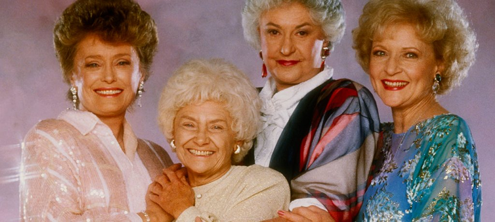
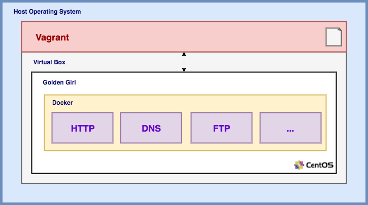

# Golden Girl
> Official-ish Golden Image Research Group



✨ All that shimmers is gold! 

# Overview



## Required Software
To get started, it's essential you have the following software installed on the host you'd like to work on:

Name | Description
--- | ---
[`git`](https://git-scm.com/) | A free and open source distributed version control system designed to handle everything from small to very large projects with speed and efficiency.
[`vagrant`](https://www.vagrantup.com/) | Provides a declarative configuration file which describes all your software requirements, packages, operating system configuration, users, and more.
[`virtualbox`](https://www.virtualbox.org/wiki/Downloads) | General-purpose full virtualizer for x86 hardware, targeted at server, desktop and embedded use.

## Docker
> You **do not** need this installed on your host operating system!

For as many services as possible, we plan on utilizing [`docker`](https://www.docker.com/) containers. 

## Getting Started

Let's grab a copy of this project:

```
$ git clone https://github.com/picatz/goldengirl.git
```

Now we can change into the `goldengirl` directory:

```
$ cd goldengirl
```

To start up the VM, we can use `vagrant` ( this could take a few minutes ):

```
$ vagrant up
``` 

Once the VM is started, we can now simply `ssh` into it:

```
$ vagrant ssh
```

To get out of the VM, simply `exit`. To completly destory it:

```
$ vagrant destroy
```
